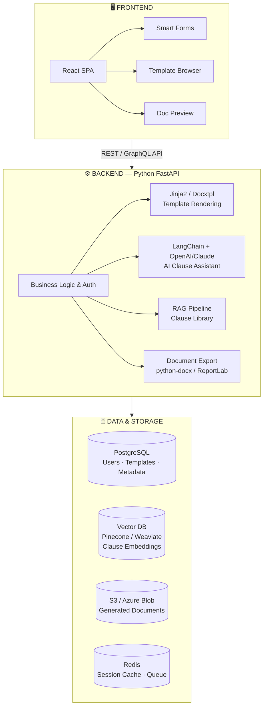
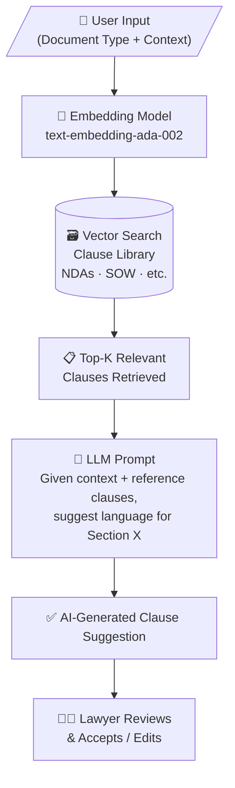

# Legal AI Document Automation Solution
### AI-Powered Template Builder for Legal Operations

---

## Executive Summary

This document outlines the design and implementation of a **Legal Document Automation Tool** — an AI-powered solution that enables lawyers and legal operations teams to generate accurate, consistent, and compliant legal documents from intelligent templates. The system is positioned for rapid development, high organizational visibility, and measurable ROI across law firms and in-house legal departments.

---

## Problem Statement

Legal professionals spend a disproportionate amount of time drafting routine documents — NDAs, employment contracts, service agreements, wills, and compliance forms. This creates three core pain points:

- **Time inefficiency**: Lawyers repeatedly draft near-identical documents with minor variations per client.
- **Human error**: Manual copy-paste and editing introduces inconsistencies and risky omissions.
- **Revenue leakage**: Senior attorneys spend billable hours on low-complexity drafting tasks.

---

## Proposed Solution

An **AI-Powered Legal Document Automation Platform** that allows legal professionals to:

1. Select from a library of intelligent document templates
2. Input case-specific parameters via smart forms
3. Automatically generate fully formatted legal documents (DOCX / PDF)
4. Use AI to suggest standard clauses, flag missing terms, and detect inconsistencies

---

## Core Features

### 1. Template Library
A curated set of legal document templates organized by category:
- **Contracts**: NDAs, Service Agreements, Employment Contracts, Vendor Agreements
- **Corporate**: Board Resolutions, Operating Agreements, Shareholder Agreements
- **Compliance**: Privacy Policies, Data Processing Agreements (DPAs), Regulatory Filings
- **Litigation Support**: Demand Letters, Settlement Agreements, Engagement Letters
- **Estate Planning**: Wills, Trusts, Power of Attorney

### 2. Smart Form Engine
- Dynamic input forms that adapt based on document type and jurisdiction
- Conditional fields (e.g., include arbitration clause only if B2B contract)
- Field validation with legal-specific rules (e.g., date format, party name formatting)
- Pre-fill from client intake data or CRM integration

### 3. AI Clause Assistant (LLM-Powered)
- Suggest standard industry clauses based on document context
- Flag missing critical clauses (e.g., indemnification, governing law, limitation of liability)
- Detect non-standard or potentially risky language
- Powered by LLMs (e.g., GPT-4 / Claude) with Retrieval-Augmented Generation (RAG) over internal clause libraries

### 4. Document Generation Engine
- Auto-populate templates with user inputs using a templating engine (Jinja2 / Handlebars)
- Export to DOCX (for attorney review and edits) and PDF (for final execution)
- Maintain formatting standards: letterhead, numbering, section headers, signature blocks

### 5. Version Control & Audit Trail
- Track every document generation with metadata (author, timestamp, inputs used)
- Maintain version history for iterative drafts
- Support for redline/tracked changes for collaborative review

### 6. Integration Layer
- **CLM Systems**: Ironclad, Icertis, DocuSign CLM
- **DMS Platforms**: iManage, NetDocuments
- **E-Signature**: DocuSign, Adobe Sign
- **Identity & SSO**: Okta, Azure AD

---

## Technical Architecture

---

## AI Integration Design

### Retrieval-Augmented Generation (RAG) for Clause Suggestions

### Risk Flag Detection

The AI layer will scan generated documents against a rule set and LLM prompts to flag:
- Missing mandatory clauses (by document type and jurisdiction)
- Unusual or non-market-standard terms
- Conflicting provisions within the same document
- Expiration/renewal gaps in time-sensitive agreements

---

## Security & Compliance

Legal data is highly sensitive. The platform must implement:

- **Encryption at rest and in transit** (AES-256, TLS 1.3)
- **Role-Based Access Control (RBAC)**: Attorney, Paralegal, Admin roles
- **Data residency controls** for multi-jurisdiction deployments
- **GDPR & CCPA compliance**: Data retention policies, right-to-erasure support
- **SOC 2 Type II audit readiness**
- **AI governance**: Model output logging, human-in-the-loop review for all AI suggestions

---

## Business Value & KPIs

| Metric | Baseline | Target (Post-Launch) |
|--------|----------|---------------------|
| Time to draft standard NDA | 45 min | 5 min |
| Attorney hours saved per month | — | 30–50 hrs per attorney |
| Document error rate | ~15% | <2% |
| Time to onboard new client | 2–3 days | Same day |
| Cost per document generated | High (billable hr) | Near zero (automated) |

---

## Conclusion

The Legal Document Automation Tool represents an ideal balance of **technical feasibility**, **organizational visibility**, and **high business impact**. It is achievable in a reasonable timeframe, directly addresses daily friction in legal workflows, and lays the groundwork for more advanced AI capabilities — making it a compelling flagship initiative for a Legal Operations AI Architect role.

---

*Document prepared as part of Legal AI Strategy Initiative*
*Version 1.0 | March 2026*
