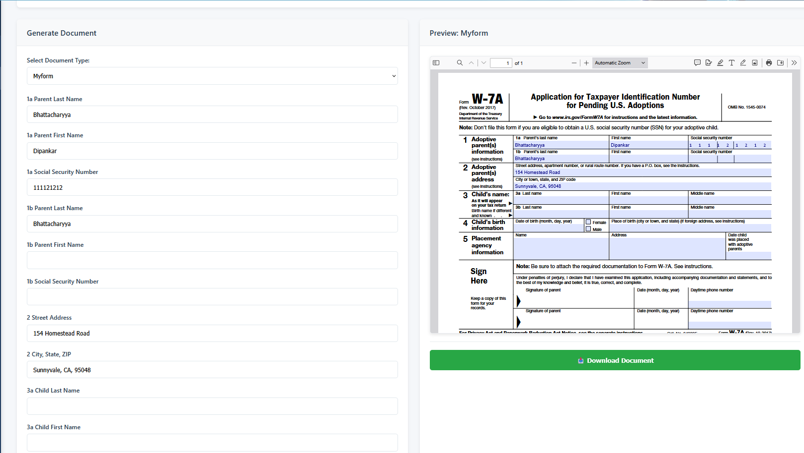
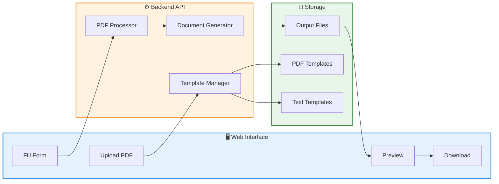
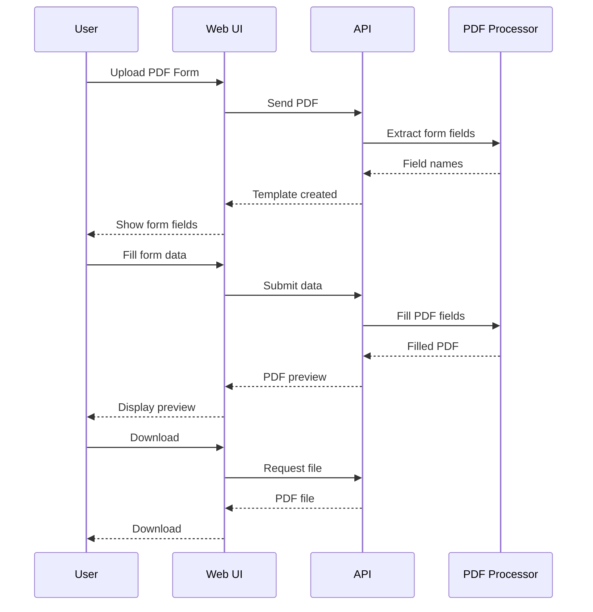
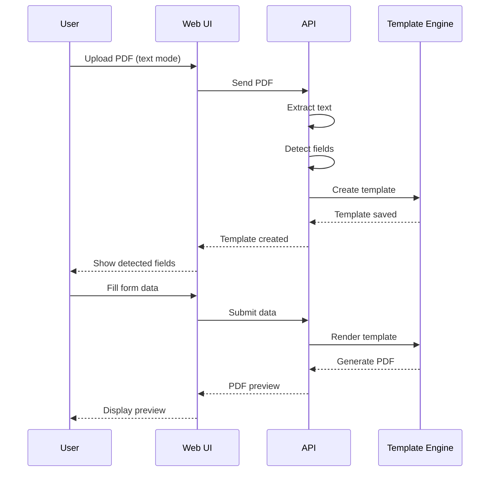
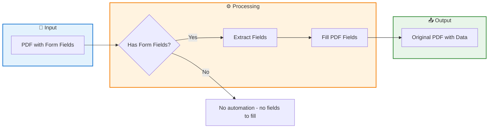

# Legal Document Automation Tool

A web-based tool for generating and filling legal documents from templates.



## Features

- **PDF Form Filling** - Fill actual PDF forms with data
- **Template Generation** - Create reusable templates from PDFs
- **Preview** - See filled documents before downloading
- **Multiple Formats** - Export as PDF or Word (DOCX)
- **Built-in Templates** - NDA, Service Contract, Will

---

## Quick Start

```bash
cd legal-doc-automation
pip install -r requirements.txt
python app.py
```

Visit: http://localhost:5000

---

## System Architecture



---

## PDF Form Filling Flow



---

## Document Generation


---

## Template Generation Flow



---

## How It Works



**Key:** PDFs with embedded form fields can be filled automatically. Since there are no fields to fill when the PDF has no form fields, no automation is available in that case.

---

## API Endpoints

| Endpoint          | Method | Description            |
| ----------------- | ------ | ---------------------- |
| `/`               | GET    | Web UI                 |
| `/api/templates`  | GET    | List all templates     |
| `/api/upload-pdf` | POST   | Upload and convert PDF |
| `/api/preview`    | POST   | Generate preview       |
| `/api/generate`   | POST   | Generate and download  |

---

## Project Structure

```
legal-doc-automation/
├── app.py                 # Web server & API
├── document_generator.py  # PDF/DOCX generation
├── pdf_form_filler.py     # PDF form filling
├── pdf_converter.py       # PDF to template
├── field_mapping.py       # Field name mappings
├── templates/             # HTML & Jinja2 templates
├── pdf_templates/         # Uploaded PDF forms
├── static/                # CSS & JavaScript
└── output/                # Generated documents
```

---

## Scripts

| Script                   | Purpose                                     |
| ------------------------ | ------------------------------------------- |
| `clean_templates.py`     | Delete all custom templates                 |
| `create_pdf_template.py` | Create PDF template with proper field names |
| `test_fill_pdf.py`       | Test PDF form filling                       |
| `test_preview.py`        | Test preview generation                     |

---

## License

DipTech Corp.
