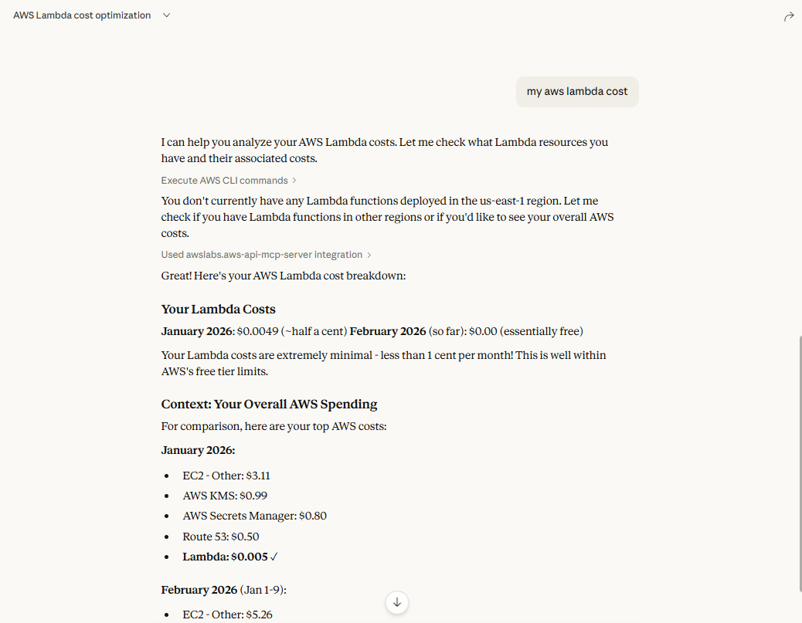
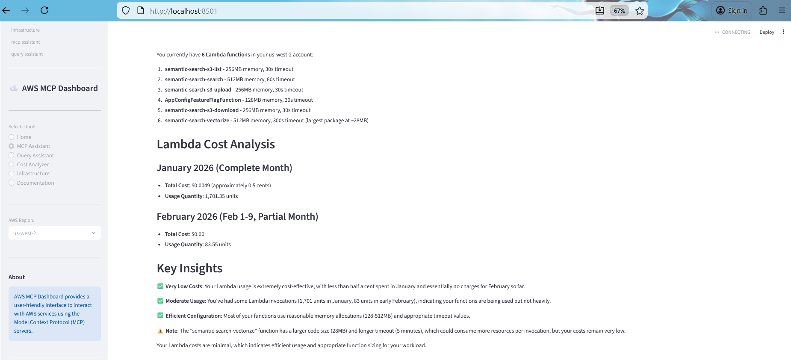

# AWS MCP Server is Working! 🎉

## It's Live

Check out Claude Desktop pulling real AWS cost data using MCP servers:

Your actual AWS costs showing up in Claude:

---

## What's Actually Happening Here

When you ask Claude about your AWS stuff, here's what goes down:

1. You ask Claude: "What's my EC2 cost?"
2. Claude hits the MCP server
3. MCP server calls AWS APIs
4. AWS sends back your real data
5. Claude shows you the results

That's it. Real data from your actual AWS account.

---

## The Cool Part

**You don't need to worry about AWS API changes.**

MCP servers handle all that. If AWS updates their APIs, the MCP server gets updated - you don't have to change anything. It just keeps working.

---

## Try It Out

### With Claude Desktop
- Open Claude Desktop
- Ask: "What's my EC2 cost?"
- Get real data back

### With the Dashboard
- Go to http://localhost:8501
- Pick "Query Assistant"
- Ask your question
- See your actual AWS info

---

## What You Can Ask

**Money stuff:**
- "What's my EC2 cost?"
- "How much am I spending on Lambda?"
- "What's my total AWS bill?"

**Infrastructure:**
- "Show me my EC2 instances"
- "List my S3 buckets"
- "What Lambda functions do I have?"

**Optimization:**
- "Find unused resources"
- "Where can I save money?"
- "What regions am I using?"

---

## Why This Matters

Before MCP:
- Had to log into AWS console manually
- Couldn't just ask Claude
- No easy way to analyze spending

Now with MCP:
- Ask Claude anything about AWS
- Get answers instantly
- Get suggestions for optimization

---

## Bottom Line

MCP servers are connecting Claude directly to your AWS account. You ask questions, Claude gets real data, and you get answers. 

**And here's the best part:** When AWS changes their APIs, MCP handles it. You don't have to do anything. It just keeps working.

---

