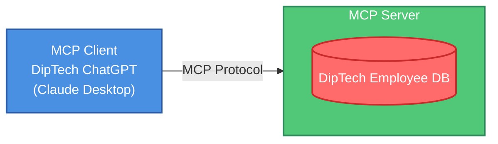

# Build Your First MCP Server: Leave Management

This MCP (Model Context Protocol) server helps HR departments manage employee leave requests. The server provides tools to check leave balances, apply for leave, and view leave history. It uses an in-memory mock database to simulate employee leave data.

> **Note:** This is a learning project - not production ready! The data resets every time you restart the server since it's all in memory.

## Architecture



## What it does

The server has these tools:

1. **`get_leave_balance`** - Check how many leave days an employee has left
   - Needs: `employee_id` (string)
   - Returns: Leave balance or error if employee doesn't exist

2. **`apply_leave`** - Request leave for specific dates
   - Needs:
     - `employee_id` (string)
     - `leave_dates` (list of date strings like `["2025-04-17", "2025-05-01"]`)
   - Returns: Confirmation with new balance, or error if not enough days available

3. **`get_leave_history`** - See all past leaves for an employee
   - Needs: `employee_id` (string)
   - Returns: List of dates or "No leaves taken"

There's also a greeting resource (`greeting://{name}`) but honestly I haven't used it much.

## Sample Data

Two test employees are hardcoded:

- **E001**: 18 days left (already used Dec 25, 2024 and Jan 1, 2025)
- **E002**: 20 days left (hasn't taken any leave yet)

// TODO: add more test employees later

## Setup (the hard way I learned)

1. **Get Claude Desktop** - Download from Anthropic's site

2. **Install uv** - This is the package manager we're using:
   ```bash
   pip install uv
   ```

3. **Create project**:
   ```bash
   uv init uv-venv
   cd uv-venv
   ```

4. **Copy files** - Move `main.py` and `pyproject.toml` into the `uv-venv` folder

5. **Install dependencies**:
   ```bash
   uv add "mcp[cli]>=1.6.0"
   ```

6. **Configure Claude Desktop** - Make sure Claude Desktop is properly configured and then close it completely before installing the server. Check Task Manager on Windows to verify it's really closed.

7. **Install the server** - Must be run from inside `uv-venv` directory:
   ```bash
   uv run mcp install main.py
   ```
   ⚠️ Don't run this from parent directory or it won't work

8. **Check it worked** - Open Claude Desktop → Settings → Developer and look for "LeaveManager"

## Quick version (what actually worked for me)

After messing around for a while, here's the steps that worked:

1. `uv init uv-venv` 
2. Copy both files to uv-venv folder
3. `uv add "mcp[cli]>=1.6.0"`
4. Configure Claude Desktop and close it completely
5. `uv run mcp install main.py` from inside uv-venv
6. Open Claude and check if it shows up

## When things break

**JSONDecodeError: Expecting value** - This means the Claude config is messed up. Make sure Claude Desktop is properly configured and completely closed before running the install command. Check Task Manager to verify it's not running in the background.

I spent way too long on this error before realizing Claude was still running in the background.

## How to use it

Talk to Claude like:
- "Check leave balance for employee E001"
- "Apply for leave on 2025-04-17 and 2025-04-18 for employee E002"
- "Show me the leave history for employee E001"

Pretty straightforward once it's set up.

## Project Structure

```
emp-leave-balance/
├── main.py             # MCP server implementation
├── pyproject.toml      # Project dependencies
├── requirements.txt    # Python dependencies
└── README.md           # This file
```

## Running it standalone

For testing without Claude:

```bash
uv run python main.py
```

Not super useful but good for debugging I guess.
