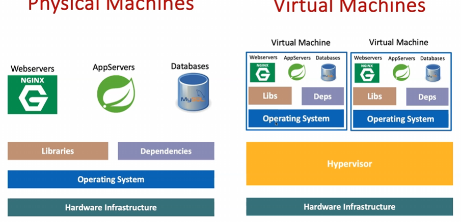
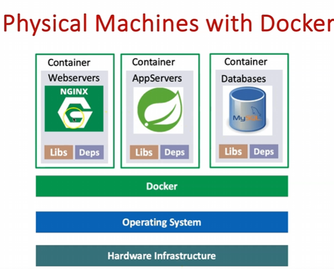

# Install Docker Desktop

Note: Not everything tested

## Step-01: Introduction

Docker is a platform that enables developers to package applications and their dependencies into lightweight, portable containers that can run consistently across different environments.
It simplifies software deployment by eliminating "it works on my machine" problems and provides isolation, scalability, and efficient resource utilization.




## Step-02: Docker Desktop - Pricing, SignUp, Download

- [Docker Desktop Pricing](https://www.docker.com/pricing/)
- [SignUp Docker Hub](https://hub.docker.com/)
- [Download Docker Desktop](https://www.docker.com/products/docker-desktop/)

## Step-03: Install Docker Desktop

### Step-03-01: MACOS: Install Docker Desktop

```t
# Install Docker Desktop
Copy Docker dmg to Applications folder

# Create Docker Hub Account
https://hub.docker.com

# Signin Docker Desktop
Open Docker Desktop and SignIn to Docker Hub
```

### Step-03-02: WINDOWS: Install Docker Desktop

```t
# Download Docker Desktop
https://www.docker.com/products/docker-desktop/

# Install Docker Desktop on Windows
Run the "Docker Desktop Installer.exe"

# Create Docker Hub Account
https://hub.docker.com

# Signin Docker Desktop
Open Docker Desktop and SignIn to Docker Hub

# Configure kubectl cli on Windows PATH
C:\Program Files\Docker\Docker\Resources\bin
```

### Step-03-03: LINUX: Install Docker Desktop

```t
# Download Docker Desktop for Linux
https://www.docker.com/products/docker-desktop/

# Supported Linux Distributions:
# - Ubuntu 22.04 LTS, 20.04 LTS
# - Debian 11, 12
# - Fedora 36, 37, 38
# - RHEL (Red Hat Enterprise Linux) 8, 9
# - CentOS Stream 8, 9

# Install Docker Desktop on Linux
# For Ubuntu/Debian:
sudo apt-get update
sudo apt-get install ./docker-desktop-<version>-<arch>.deb

# For Fedora/RHEL/CentOS:
sudo yum install ./docker-desktop-<version>-<arch>.rpm
# OR for newer versions (RHEL 8+, CentOS Stream 8+):
sudo dnf install ./docker-desktop-<version>-<arch>.rpm

# Start Docker Desktop
systemctl --user start docker-desktop

# Create Docker Hub Account
https://hub.docker.com

# Signin Docker Desktop
Open Docker Desktop and SignIn to Docker Hub

# Note: Docker Desktop for Linux requires:
# - 64-bit kernel and CPU support for virtualization
# - KVM virtualization support
# - QEMU must be version 5.2 or newer
# - systemd init system
```
