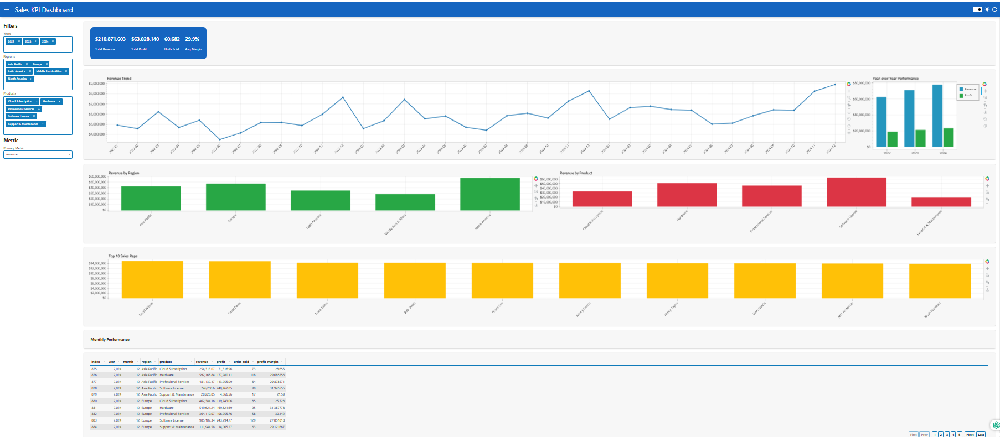

# Sales KPI Dashboard (Panel + Bokeh)
This dashboard is built with Panel and Bokeh to explore sales KPIs with interactive filters and charts.

## Quick start
1) Install dependencies (preferably in a virtual env):
   ```bash
   pip install -r requirements-dashboard.txt
   ```
2) Serve the optimized app:
   ```bash
   panel serve sales_dashboard_server_optimized.py --show --autoreload
   ```
3) Open the browser at `http://localhost:5006/sales_dashboard_server_optimized`.

## Data
- Expected CSV: `sales_data.csv`
- Required columns: `date`, `region`, `product`, `sales_rep`, `revenue`, `profit`, `units_sold`, `profit_margin`
- Date is parsed to derive `year`, `month`, and `year_month` (period string).

## Features
- KPI summary (revenue, profit, units sold, avg margin)
- Trend, YoY bars, region/product/reps bars, profit vs revenue scatter
- Interactive filters: year, region, product, primary metric
- Tabular monthly summary (Tabulator)

## Notes
- If port 5006 is busy try another port
- Autoreload warning about `watchfiles` is informational; install `watchfiles` for faster reloads.
- For large CSVs, consider sampling or pre-aggregating before serving.

N.B: Internal note: taken for non aws project

## Dashboard Preview
Below is a preview of how the Sales KPI Dashboard looks:

