## HTTPS/TLS Handshake Diagram

```mermaid
sequenceDiagram
    participant Client as Client (Browser)
    participant Server as Server

    Note over Client,Server: Step 1: TCP Connection Establishment
    Client->>Server: TCP SYN
    Server->>Client: TCP SYN + ACK
    Client->>Server: TCP ACK
    Note over Client,Server: Connection Established

    Note over Client,Server: Step 2: TLS Handshake - Certificate Exchange<br/>(Asymmetric Encryption)
    Note over Client: Client Hello:<br/>- Supported TLS versions (1.2, 1.3)<br/>- List of cipher suites<br/>(encryption algorithms)
    Client->>Server: Client Hello<br/>(TLS versions, cipher suites)
    Note over Server: Server Hello:<br/>- Selects best TLS version<br/>- Chooses cipher suite<br/>(from client's list)
    Server->>Client: Server Hello<br/>(Selected TLS version & cipher suite)
    Server->>Client: Certificate<br/>(Contains Server Public Key 🔵)
    Server->>Client: Server Hello Done
    Note over Server: Asymmetric Encryption<br/>Public Key 🔵 | Private Key 🔴

    Note over Client,Server: Step 3: Key Exchange<br/>(Asymmetric Encryption)
    Note over Client: Generate Session Key<br/>(Symmetric Key 🟡)
    Note over Client: Encrypt Session Key<br/>with Server Public Key 🔵
    Client->>Server: Client Key Exchange<br/>(Encrypted Session Key 🔐)
    Note over Server: Decrypt with Private Key 🔴<br/>to get Session Key 🟡
    Note over Client: Change Cipher Spec:<br/>"Switch to symmetric<br/>encryption now"
    Client->>Server: Change Cipher Spec
    Note over Client: Finished:<br/>First message encrypted<br/>with session key 🟡<br/>(proves handshake worked)
    Client->>Server: Finished<br/>(Encrypted with Session Key 🟡)
    Note over Server: Change Cipher Spec:<br/>"Switch to symmetric<br/>encryption now"
    Server->>Client: Change Cipher Spec
    Note over Server: Finished:<br/>First message encrypted<br/>with session key 🟡<br/>(proves handshake worked)
    Server->>Client: Finished<br/>(Encrypted with Session Key 🟡)
    Note over Client,Server: Both sides now have<br/>shared Session Key 🟡<br/>Handshake complete!

    Note over Client,Server: Step 4: Secure Data Transmission<br/>(Symmetric Encryption)
    Note over Client,Server: All data encrypted/decrypted<br/>using Session Key 🟡
    Client->>Server: Encrypted Data 🔐<br/>(Using Session Key 🟡)
    Server->>Client: Encrypted Data 🔐<br/>(Using Session Key 🟡)
    Note over Client,Server: Symmetric Encryption<br/>Session Key 🟡
```

**Legend:**

- 🔵 = Public Key (Asymmetric)
- 🔴 = Private Key (Asymmetric)
- 🟡 = Session Key (Symmetric)
- 🔐 = Encrypted Data

## HTTPS: How It Works

**Overview:** HTTPS encrypts data between browser and server using TLS (Transport Layer Security), preventing interception of sensitive information like passwords and credit card numbers.

### TLS Handshake Process

1. **TCP Connection:** Browser establishes TCP connection with server
2. **Certificate Exchange:**
   - Client sends "Client Hello" (TLS version, cipher suites)
   - Server responds with "Server Hello" (selected TLS version, cipher suite)
   - Server sends **certificate containing its public key**
3. **Key Exchange:**
   - Client generates a **session key** (symmetric encryption key)
   - Client encrypts the session key using **server's public key** (asymmetric encryption)
   - Client sends encrypted session key to server
   - Server decrypts it using its **private key**
   - **Change Cipher Spec:** Both sides signal "switch to symmetric encryption now"
   - **Finished:** Both sides send their first message encrypted with the session key to prove the handshake worked
4. **Secure Data Transmission:**
   - Both client and server now share the same session key
   - All subsequent data is encrypted/decrypted using this **session key** (symmetric encryption)

### What is a Cipher Suite?

A **cipher suite** is not a single algorithm like "RSA 256". Instead, it's a **combination of 4 different cryptographic algorithms** that work together to secure the connection:

1. **Key Exchange Algorithm** - How the session key is securely shared (e.g., RSA, Diffie-Hellman)
2. **Authentication Algorithm** - How the server proves its identity (e.g., RSA signature, ECDSA)
3. **Encryption Algorithm** - How the actual data is encrypted (e.g., AES-256, ChaCha20)
4. **Message Authentication Code (MAC)** - How data integrity is verified (e.g., SHA-256, SHA-384)

**Example Cipher Suite:** `TLS_ECDHE_RSA_WITH_AES_256_GCM_SHA384`

- `ECDHE` = Elliptic Curve Diffie-Hellman Ephemeral (key exchange)
- `RSA` = RSA signature (authentication)
- `AES_256_GCM` = AES-256 encryption in GCM mode (data encryption)
- `SHA384` = SHA-384 hash (message authentication)

**In the Client Hello:** The browser sends a list of cipher suites it supports (e.g., "I can use AES-256 with RSA, or ChaCha20 with ECDSA, etc."). The server then picks the best one from that list.

### Why Are "Change Cipher Spec" and "Finished" Required?

**Yes, both are required** for a secure TLS handshake:

1. **Change Cipher Spec:**

   - **Purpose:** Signals that both sides should switch from unencrypted handshake messages to encrypted messages using the session key
   - **Why needed:** Creates a clear boundary - everything before this is unencrypted handshake, everything after uses symmetric encryption
   - **Without it:** Both sides wouldn't know when to start using the session key

2. **Finished:**
   - **Purpose:** The first message encrypted with the session key - proves the handshake was successful
   - **Why needed:**
     - Verifies that both sides have the same session key (if decryption works, keys match)
     - Prevents man-in-the-middle attacks (attacker can't forge this without the session key)
     - Confirms all previous handshake messages were received correctly
   - **Without it:** No way to verify the handshake completed successfully and securely

**Together:** They ensure a secure transition from handshake to encrypted data transmission.

### Where Encryption Types Are Used

**Asymmetric Encryption (Public/Private Key Pair):**

- **Used during:** Certificate exchange and key exchange (Steps 2-3)
- **Purpose:** Securely transmit the session key over the internet
- **How:** Client encrypts session key with server's public key; only server's private key can decrypt it
- **Example:** RSA or Diffie-Hellman (TLS 1.3)

**Symmetric Encryption (Shared Session Key):**

- **Used during:** All data transmission after handshake (Step 4)
- **Purpose:** Fast, efficient encryption of bulk application data
- **How:** Both sides use the same session key to encrypt/decrypt messages
- **Why:** Asymmetric encryption is computationally expensive; symmetric is much faster for data transfer

**Key Insight:** Asymmetric encryption secures the initial key exchange, then symmetric encryption handles all actual data transmission for performance.
