## HTTPS/TLS Handshake Diagram

```mermaid
sequenceDiagram
    participant Client as Client (Browser)
    participant Server as Server

    Note over Client,Server: Step 1: TCP Connection Establishment
    Client->>Server: TCP SYN
    Server->>Client: TCP SYN + ACK
    Client->>Server: TCP ACK
    Note over Client,Server: Connection Established

    Note over Client,Server: Step 2: TLS Handshake - Certificate Exchange<br/>(Asymmetric Encryption)
    Note over Client: Client Hello:<br/>- Supported TLS versions (1.2, 1.3)<br/>- List of cipher suites<br/>(encryption algorithms)
    Client->>Server: Client Hello<br/>(TLS versions, cipher suites)
    Note over Server: Server Hello:<br/>- Selects best TLS version<br/>- Chooses cipher suite<br/>(from client's list)
    Server->>Client: Server Hello<br/>(Selected TLS version & cipher suite)
    Server->>Client: Certificate<br/>(Contains Server Public Key 🔵)
    Server->>Client: Server Hello Done
    Note over Server: Asymmetric Encryption<br/>Public Key 🔵 | Private Key 🔴

    Note over Client,Server: Step 3: Key Exchange<br/>(Asymmetric Encryption)
    Note over Client: Generate Session Key<br/>(Symmetric Key 🟡)
    Note over Client: Encrypt Session Key<br/>with Server Public Key 🔵
    Client->>Server: Client Key Exchange<br/>(Encrypted Session Key 🔐)
    Note over Server: Decrypt with Private Key 🔴<br/>to get Session Key 🟡
    Note over Client: Change Cipher Spec:<br/>"Switch to symmetric<br/>encryption now"
    Client->>Server: Change Cipher Spec
    Note over Client: Finished:<br/>First message encrypted<br/>with session key 🟡<br/>(proves handshake worked)
    Client->>Server: Finished<br/>(Encrypted with Session Key 🟡)
    Note over Server: Change Cipher Spec:<br/>"Switch to symmetric<br/>encryption now"
    Server->>Client: Change Cipher Spec
    Note over Server: Finished:<br/>First message encrypted<br/>with session key 🟡<br/>(proves handshake worked)
    Server->>Client: Finished<br/>(Encrypted with Session Key 🟡)
    Note over Client,Server: Both sides now have<br/>shared Session Key 🟡<br/>Handshake complete!

    Note over Client,Server: Step 4: Secure Data Transmission<br/>(Symmetric Encryption)
    Note over Client,Server: All data encrypted/decrypted<br/>using Session Key 🟡
    Client->>Server: Encrypted Data 🔐<br/>(Using Session Key 🟡)
    Server->>Client: Encrypted Data 🔐<br/>(Using Session Key 🟡)
    Note over Client,Server: Symmetric Encryption<br/>Session Key 🟡
```



**Legend:**

- 🔵 = Public Key (Asymmetric)
- 🔴 = Private Key (Asymmetric)
- 🟡 = Session Key (Symmetric)
- 🔐 = Encrypted Data

## HTTPS: How It Works

**Overview:** HTTPS encrypts data between browser and server using TLS (Transport Layer Security), preventing interception of sensitive information like passwords and credit card numbers.

### TLS Handshake Process

1. **TCP Connection:** Browser establishes TCP connection with server
2. **Certificate Exchange:**
   - Client sends "Client Hello" (TLS version, cipher suites)
   - Server responds with "Server Hello" (selected TLS version, cipher suite)
   - Server sends **certificate containing its public key**
3. **Key Exchange:**
   - Client generates a **session key** (symmetric encryption key)
   - Client encrypts the session key using **server's public key** (asymmetric encryption)
   - Client sends encrypted session key to server
   - Server decrypts it using its **private key**
   - **Change Cipher Spec:** Both sides signal "switch to symmetric encryption now"
   - **Finished:** Both sides send their first message encrypted with the session key to prove the handshake worked
4. **Secure Data Transmission:**
   - Both client and server now share the same session key
   - All subsequent data is encrypted/decrypted using this **session key** (symmetric encryption)

### What is a Cipher Suite?

A **cipher suite** is not a single algorithm like "RSA 256". Instead, it's a **combination of 4 different cryptographic algorithms** that work together to secure the connection:

1. **Key Exchange Algorithm** - How the session key is securely shared (e.g., RSA, Diffie-Hellman)
2. **Authentication Algorithm** - How the server proves its identity (e.g., RSA signature, ECDSA)
3. **Encryption Algorithm** - How the actual data is encrypted (e.g., AES-256, ChaCha20)
4. **Message Authentication Code (MAC)** - How data integrity is verified (e.g., SHA-256, SHA-384)

**Example Cipher Suite:** `TLS_ECDHE_RSA_WITH_AES_256_GCM_SHA384`

- `ECDHE` = Elliptic Curve Diffie-Hellman Ephemeral (key exchange)
- `RSA` = RSA signature (authentication)
- `AES_256_GCM` = AES-256 encryption in GCM mode (data encryption)
- `SHA384` = SHA-384 hash (message authentication)

**In the Client Hello:** The browser sends a list of cipher suites it supports (e.g., "I can use AES-256 with RSA, or ChaCha20 with ECDSA, etc."). The server then picks the best one from that list.

### Why Are "Change Cipher Spec" and "Finished" Required?

**Yes, both are required** for a secure TLS handshake:

1. **Change Cipher Spec:**

   - **Purpose:** Signals that both sides should switch from unencrypted handshake messages to encrypted messages using the session key
   - **Why needed:** Creates a clear boundary - everything before this is unencrypted handshake, everything after uses symmetric encryption
   - **Without it:** Both sides wouldn't know when to start using the session key

2. **Finished:**
   - **Purpose:** The first message encrypted with the session key - proves the handshake was successful
   - **Why needed:**
     - Verifies that both sides have the same session key (if decryption works, keys match)
     - Prevents man-in-the-middle attacks (attacker can't forge this without the session key)
     - Confirms all previous handshake messages were received correctly
   - **Without it:** No way to verify the handshake completed successfully and securely

**Together:** They ensure a secure transition from handshake to encrypted data transmission.

### Where Encryption Types Are Used

**Asymmetric Encryption (Public/Private Key Pair):**

- **Used during:** Certificate exchange and key exchange (Steps 2-3)
- **Purpose:** Securely transmit the session key over the internet
- **How:** Client encrypts session key with server's public key; only server's private key can decrypt it
- **Example:** RSA or Diffie-Hellman (TLS 1.3)

**Symmetric Encryption (Shared Session Key):**

- **Used during:** All data transmission after handshake (Step 4)
- **Purpose:** Fast, efficient encryption of bulk application data
- **How:** Both sides use the same session key to encrypt/decrypt messages
- **Why:** Asymmetric encryption is computationally expensive; symmetric is much faster for data transfer

**Key Insight:** Asymmetric encryption secures the initial key exchange, then symmetric encryption handles all actual data transmission for performance.

---

## OSI Model: The 7-Layer Network Architecture

**Overview:** The OSI (Open Systems Interconnection) model is a conceptual framework that standardizes the functions of a telecommunication or computing system into seven abstraction layers. It helps understand how data flows from an application on one device to an application on another device across a network.

### The 7 Layers of OSI Model

```
┌─────────────────────────────────────────────────────────────┐
│ Layer 7: Application Layer                                  │
│  (HTTP, HTTPS, SMTP, FTP, DNS, SSH, Telnet)                 │
├─────────────────────────────────────────────────────────────┤
│ Layer 6: Presentation Layer                                 │
│  (SSL/TLS, Encryption, Compression, Data Formatting)       │
├─────────────────────────────────────────────────────────────┤
│ Layer 5: Session Layer                                      │
│  (Session Management, Authentication, Authorization)       │
├─────────────────────────────────────────────────────────────┤
│ Layer 4: Transport Layer                                    │
│  (TCP, UDP, Port Numbers, Flow Control, Error Recovery)     │
├─────────────────────────────────────────────────────────────┤
│ Layer 3: Network Layer                                      │
│  (IP, ICMP, Routers, IP Addressing, Routing)               │
├─────────────────────────────────────────────────────────────┤
│ Layer 2: Data Link Layer                                   │
│  (Ethernet, MAC Addresses, Switches, Frames)               │
├─────────────────────────────────────────────────────────────┤
│ Layer 1: Physical Layer                                    │
│  (Cables, Hubs, Bits, Electrical Signals, Radio Waves)     │
└─────────────────────────────────────────────────────────────┘
```

### Detailed Layer Descriptions

#### Layer 7: Application Layer

**Purpose:** Provides network services directly to user applications.

**Functions:**

- User interface for network services
- Application-specific protocols
- Data formatting and presentation to users

**Protocols & Examples:**

- **HTTP/HTTPS:** Web browsing
- **SMTP:** Email sending
- **FTP:** File transfer
- **DNS:** Domain name resolution
- **SSH:** Secure remote access
- **Telnet:** Remote terminal access

**Data Unit:** Message/Data

**Example:** When you type `https://example.com` in a browser, the Application layer formats the HTTP request.

---

#### Layer 6: Presentation Layer

**Purpose:** Translates, encrypts, and compresses data for the Application layer.

**Functions:**

- Data translation (e.g., ASCII to EBCDIC)
- Data encryption/decryption
- Data compression/decompression
- Character encoding (UTF-8, ASCII)

**Protocols & Examples:**

- **SSL/TLS:** Encryption (part of HTTPS)
- **JPEG, PNG, GIF:** Image encoding
- **MPEG, AVI:** Video encoding
- **ASCII, Unicode:** Text encoding

**Data Unit:** Formatted Data

**Example:** TLS encryption happens at this layer, converting plain HTTP into encrypted HTTPS.

---

#### Layer 5: Session Layer

**Purpose:** Establishes, manages, and terminates sessions between applications.

**Functions:**

- Session establishment, maintenance, and termination
- Dialog control (full-duplex, half-duplex)
- Synchronization checkpoints
- Session recovery

**Protocols & Examples:**

- **NetBIOS:** Network Basic Input/Output System
- **RPC:** Remote Procedure Call
- **PPTP:** Point-to-Point Tunneling Protocol
- **SQL:** Database sessions

**Data Unit:** Session Data

**Example:** Managing a login session - establishing connection, maintaining it while active, and closing it when done.

---

#### Layer 4: Transport Layer

**Purpose:** Provides end-to-end data transfer services between applications.

**Functions:**

- Segmentation and reassembly of data
- Connection-oriented (TCP) or connectionless (UDP) communication
- Flow control
- Error detection and recovery
- Port addressing

**Protocols & Examples:**

- **TCP (Transmission Control Protocol):**
  - Connection-oriented
  - Reliable, ordered delivery
  - Flow control and error recovery
  - Used by HTTP, HTTPS, FTP, SSH
- **UDP (User Datagram Protocol):**
  - Connectionless
  - Fast, low overhead
  - No guarantee of delivery
  - Used by DNS, DHCP, streaming media

**Data Unit:** Segments (TCP) or Datagrams (UDP)

**Example:** TCP ensures all packets of a web page arrive in order and without errors. Port numbers (80 for HTTP, 443 for HTTPS) are used here.

---

#### Layer 3: Network Layer

**Purpose:** Routes data packets from source to destination across multiple networks.

**Functions:**

- Logical addressing (IP addresses)
- Routing (determining best path)
- Packet forwarding
- Fragmentation and reassembly

**Protocols & Examples:**

- **IP (Internet Protocol):** IPv4 and IPv6
- **ICMP:** Internet Control Message Protocol (ping, traceroute)
- **ARP:** Address Resolution Protocol
- **RIP, OSPF, BGP:** Routing protocols

**Devices:** Routers, Layer 3 Switches

**Data Unit:** Packets

**Example:** When sending data to `192.168.1.100`, the Network layer determines the routing path through routers.

---

#### Layer 2: Data Link Layer

**Purpose:** Transfers data between nodes on the same network segment.

**Functions:**

- Physical addressing (MAC addresses)
- Frame synchronization
- Error detection (CRC)
- Flow control
- Media access control (MAC sublayer)

**Protocols & Examples:**

- **Ethernet:** Most common LAN protocol
- **Wi-Fi (802.11):** Wireless networking
- **PPP:** Point-to-Point Protocol
- **Frame Relay:** WAN protocol
- **VLAN:** Virtual LANs

**Devices:** Switches, Bridges, Network Interface Cards (NICs)

**Data Unit:** Frames

**Example:** Ethernet frames contain MAC addresses (e.g., `00:1B:44:11:3A:B7`) to identify devices on the local network.

---

#### Layer 1: Physical Layer

**Purpose:** Transmits raw bit stream over physical medium.

**Functions:**

- Physical connection between devices
- Bit transmission (0s and 1s)
- Signal encoding
- Physical topology
- Transmission rate

**Components & Examples:**

- **Cables:** Twisted pair (Cat5, Cat6), Coaxial, Fiber optic
- **Connectors:** RJ-45, USB, SFP
- **Hubs:** Physical layer repeaters
- **Wireless:** Radio waves, infrared, Bluetooth
- **Standards:** 1000BASE-T, 10GBASE-SR

**Devices:** Hubs, Repeaters, Cables, Wireless Access Points

**Data Unit:** Bits

**Example:** Electrical signals on an Ethernet cable or radio waves in Wi-Fi represent binary data (0s and 1s).

---

### How Data Flows Through OSI Layers

**Sending Data (Encapsulation):**

```
Application Data
    ↓
+ Presentation Header (encryption, formatting)
    ↓
+ Session Header (session info)
    ↓
+ Transport Header (TCP/UDP, port numbers)
    ↓
+ Network Header (IP addresses)
    ↓
+ Data Link Header (MAC addresses) + Trailer (CRC)
    ↓
+ Physical Layer (bits on wire)
```

**Receiving Data (Decapsulation):**

```
Physical Layer (bits from wire)
    ↓
- Data Link Header/Trailer
    ↓
- Network Header
    ↓
- Transport Header
    ↓
- Session Header
    ↓
- Presentation Header (decryption)
    ↓
Application Data
```

### OSI Model and HTTPS/TLS

When you access `https://example.com`, here's how it maps to OSI layers:

1. **Application (Layer 7):** HTTP request is created
2. **Presentation (Layer 6):** TLS encrypts the HTTP data
3. **Session (Layer 5):** TLS session is established and maintained
4. **Transport (Layer 4):** TCP ensures reliable delivery on port 443
5. **Network (Layer 3):** IP routes packets to destination server
6. **Data Link (Layer 2):** Ethernet frames with MAC addresses
7. **Physical (Layer 1):** Bits transmitted over cable or wireless

### Mnemonics to Remember the Layers

**From Top to Bottom:**

- **All People Seem To Need Data Processing**
- **Away Pizza Sausage Throw Not Do Please**

**From Bottom to Top:**

- **Please Do Not Throw Sausage Pizza Away**
- **Physical Data Never Seems To Apply Properly**

### OSI vs TCP/IP Model

While OSI has 7 layers, the TCP/IP model (more commonly used in practice) has 4 layers:

| TCP/IP Model   | OSI Model Layers                                |
| -------------- | ----------------------------------------------- |
| Application    | 7. Application<br>6. Presentation<br>5. Session |
| Transport      | 4. Transport                                    |
| Internet       | 3. Network                                      |
| Network Access | 2. Data Link<br>1. Physical                     |

**Key Takeaway:** The OSI model is a theoretical framework for understanding networking, while TCP/IP is the practical implementation used on the internet.
